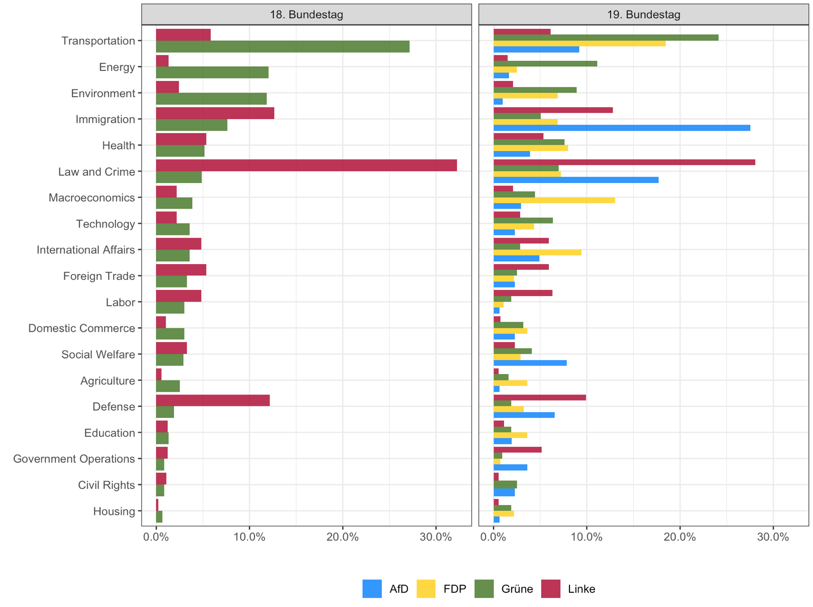

```{r setup, include = F}
knitr::opts_chunk$set(echo = T, warning = F, message = F, error = F)
```


This repo stores code and graphics from my seminar project which investigates the agenda setting of the opposition paerties in the German Bundestag. Therefore, all minor interpellations of the 18th and 19th legislature were used. 

## Packages
```{r}
pacman::p_load(dplyr, haven, readr, purrr, ggplot2, downloader, pdftools, stringr, ggthemes, lubridate, tm, RTextTools, magrittr, forcats)
```

## Data

Source of downloaded data can be found here: [DIP (Dokumentations- und Informationssystem für Parlamentarische Vorgänge)](https://dipbt.bundestag.de/dip21.web/bt)

```{r}
# URLs for the 18th legislature
urls_18 <- str_c(rep("http://dipbt.bundestag.de/dip21/btd/18/", each = 13700), 
                 as.character(sprintf("%03d", 000:136)) %>% rep(each = 100), 
                 rep("/18", each = 13700), 
                 as.character(sprintf("%05d", 00000:13699)), 
                 rep(".pdf", each = 13700), 
                 spe = "") %>% 
  .[!. == "http://dipbt.bundestag.de/dip21/btd/18/000/1800000.pdf"]

# URLs for the 19th legislature
urls_19 <- str_c(rep("http://dipbt.bundestag.de/dip21/btd/19/0", each = 6700),
                 as.character(sprintf("%02d", 00:66)) %>% rep(each = 100) , 
                 rep("/190", each = 6700), 
                 as.character(sprintf("%04d", 0000:6699)), 
                 rep(".pdf", each = 6700), 
                 sep = "") %>% 
  .[!. == "http://dipbt.bundestag.de/dip21/btd/19/000/1900000.pdf"]

# pathes for files
path_18 <- paste("./18_btd/", basename(urls_18), sep = "")
path_19 <- paste("./19_btd/", basename(urls_19), sep = "")
```

Now, the creaeted URLs can be used for downloading all documents.

```{r, eval=F, echo=T}
# creating sleep and safely function
sleep_down <- function(...) {
  download(...)
  Sys.sleep(0.5)
}

safe_download <- safely(sleep_down)

# downloading all files
map_results_18 <- map2(urls_18, path_18,
                    ~safe_download(.x, .y, mode ="wb"))

map_results_19 <- map2(urls_19, path_19,
                       ~safe_download(.x, .y, mode = "wb"))
```

Content and party were extracted from the documents (for more details see `data_wrangling.Rmd`). However, there are some messy for loops (sorry for that). The title and date were supplemented with a CSV file. The first resulting data frame contains file, date, party, title, and content.

## Categorization

After cleaning title and content (e.g. numbers, stopwords, punctuations and more) we can start with the categorization of the documents. Two methods were used. First of all, a simple word-matching with topic-specific words were made. Furthermore, overlapping matches were detected and corrected. Finally, supervised machine learning were used (Random Forest and Support Vector Machines).

### Word-Matching
```{r, eval=F, echo=T}
# word matching (Lists of words can be found in `categorization.Rmd`)
df_complete_clean %<>% 
  mutate(thema = case_when(
    str_detect(title, makroöko) ~ "Macroeconomics", 
    str_detect(title, buerger) ~ "Civil Rights",
    str_detect(title, gesundheit) ~ "Health", 
    str_detect(title, agrar) ~ "Agriculture", 
    str_detect(title, arbeit) ~ "Labor", 
    str_detect(title, bildung) ~ "Education", 
    str_detect(title, umwelt) ~ "Environment", 
    str_detect(title, energie) ~ "Energy", 
    str_detect(title, einwanderung) ~ "Immigration", 
    str_detect(title, transport) ~ "Transportation", 
    str_detect(title, krimi) ~ "Law and Crime", 
    str_detect(title, sozi) ~ "Social Welfare", 
    str_detect(title, wohn) ~ "Housing", 
    str_detect(title, banken) ~ "Domestic Commerce", 
    str_detect(title, verteidigung) ~ "Defense",
    str_detect(title, tech_kom) ~ "Technology", 
    str_detect(title, außenh) ~ "Foreign Trade",
    str_detect(title, int_aus) ~ "International Affairs",
    str_detect(title, regierung) ~ "Government Operations",
    TRUE ~ "Other"
  ))
```

```{r include=FALSE}
load("df_complete_clean_v2.RData")
unique(df_complete_clean_v2$thema)
df_english <- df_complete_clean_v2 %>% 
  mutate(thema = case_when(
    thema == "Makroökonomie" ~ "Macroeconomics",
    thema == "Bürgerrechte" ~ "Civil Rights",
    thema == "Gesundheit" ~ "Health",
    thema == "Agrarwirtschaft" ~ "Agriculture",  
    thema == "Arbeit" ~ "Labor",
    thema == "Bildung" ~ "Education",
    thema == "Umwelt" ~ "Environment", 
    thema == "Energie" ~ "Energy", 
    thema == "Einwanderung" ~ "Immigration", 
    thema == "Transport" ~ "Transportation",
    thema == "Gesetz & Kriminalität" ~ "Law and Crime", 
    thema == "Soziale Wohlfahrt" ~ "Social Welfare",
    thema == "Wohnungsbau" ~ "Housing", 
    thema == "Binnenhandel" ~ "Domestic Commerce", 
    thema == "Verteidigung" ~ "Defense",
    thema == "Technologie" ~ "Technology",
    thema == "Außenhandel" ~ "Foreign Trade",
    thema == "Int. Angelegenheiten" ~ "International Affairs",
    thema == "Regierungsoperationen" ~ "Government Operations",
    thema == "zSonstiges" ~ "Other" 
   )
  )
```


```{r, eval=F, echo=T}
df_english %>%
  filter(thema != "Other") %>%
  group_by(bt_f, thema) %>%
  summarise(n = n()) %>%
  mutate(perc = (n/sum(n))) %>%
  ggplot(aes(x = reorder(thema, +perc), y = perc)) +
  geom_bar(position = "dodge", 
           stat = "identity",
           fill = "skyblue4",
           alpha = 0.9) +
  facet_wrap(~bt_f, labeller = label_value) +
  geom_text(aes(y = perc, 
                label = sprintf("%1.1f%%", round(100*perc, 1))),
            size = 3.1,
            color=rgb(100,100,100, maxColorValue=255),
            hjust=-0.1) +
  ggtitle("") + ylab("") + xlab("") +
  theme_bw() + theme(text=element_text(size = 12)) +
  scale_y_continuous(labels = scales::percent_format(), limits=c(0,0.23)) +
  coord_flip()
```


### Supervised Machine Learning

The package `RTextTools` were used for using Random Forest and Support Vector Machines. 

```{r, eval=F, echo=T}
# creating training set
df_training_eng <- df_english %>% 
  filter(thema != "Other") %>% 
  sample_n(3047) 

# creating document-term matrix
df_content_matrix <- create_matrix(df_training_eng$content)

# remove sparse terms
df_content_matrix <- removeSparseTerms(df_content_matrix, sparse = .99)

container_eng <- create_container(df_content_matrix, 
                                  df_training_eng$thema, 
                                  trainSize=1:2300,
                                  testSize=2301:3047, 
                                  virgin=FALSE)
```

```{r, eval=F, echo=T}
# Support Vector Machines 
svm <- train_model(container_eng,"SVM", kernel = "linear", cost = 10)
svm_classify <- classify_model(container_eng, svm)

# data preparation for plotting
df_svm_eng <- svm_classify %>% 
  mutate(model = as.factor("Support Vector Machine")) %>% 
  rename(prob = SVM_PROB,
         label = SVM_LABEL) 

# Random Forest
rf_200 <- train_model(container_eng, "RF", ntree = 200)
rf_classify_200 <- classify_model(container_eng, rf_200)

# data preparation for plotting
df_rf_200_eng <- rf_classify_200 %>% 
  mutate(model = as.factor("Random Forest")) %>% 
  rename(prob = FORESTS_PROB,
         label = FORESTS_LABEL)

prob_plot_df <- rbind.data.frame(df_rf_200_eng, df_svm_eng)
rob_plot_df %>% 
  group_by(model) %>% 
  mutate(label = fct_reorder(label, prob)) %>% 
  ggplot(aes(x = label, y = prob, fill = label)) +
  geom_boxplot(alpha = 0.2) +
  geom_jitter(width = 0.2, alpha = 0.2) +
  theme_bw() +
  xlab("") +
  ylab("Class Probabilities") +
  facet_wrap(~ model) +
  theme(legend.position = "none") +
  coord_flip() 
```


After testing both algorithm the final categorization were made with a combination of RF and SVM. Moreover, cut off values for class probabilities were used. More details can be found in `categorisation_machine_learning.Rmd`.

## Key Results
### Minor Interpellations by Party
```{r, eval=F, echo=T}
df_english %>% 
  filter(party != "NA") %>% 
  mutate(date_n = as.Date(date, "%d.%m.%Y")) %>% 
  mutate(year = year(date_n),
         party = case_when(party == "Union" ~ "CDU/CSU",
                           TRUE ~ party)) %>% 
  mutate(year = as.character(year)) %>% 
  group_by(party, year, bt_f) %>% 
  summarise(n = n()) %>% 
  ggplot(aes(x = as.factor(year), fill = reorder(party, -n), y = n)) +
  geom_bar(position="dodge", 
           stat="identity",
           alpha = 0.9) +
  geom_text(position = position_dodge(width = 1), # positioning for grouped barplot
            aes(label = n), # n-value should be the label for each bar
            vjust = -0.5, # adjusting the vertical dimension (overlapping)
            size = 3) + # setting the size of the label
  xlab("") + 
  ylab("") + 
  labs(fill = "") +
  theme(legend.position="bottom") +
  theme_hc() +
  scale_fill_manual(values = c("Grüne" = "#50822E", "Linke" = "#B61C3E", 
                     "CDU/CSU" = "#32372C", "SPD" = "#E3000F", "AfD" = "#0088FF", "FDP" = "#FFD600")) +
  facet_wrap(~ bt_f, 
             strip.position = "top", # position of labels
             dir = "v") +# positioning of plots 
  scale_y_continuous(limits = c(0,800))
```


### Minor Interpellations by Topic & Legislature
```{r include=FALSE}
load("df_complete_clean_f.RData")
df_english <- df_complete_clean_f %>% 
  mutate(label_eng = case_when(
    label == "Makroökonomie" ~ "Macroeconomics",
    label == "Bürgerrechte" ~ "Civil Rights",
    label == "Gesundheit" ~ "Health",
    label == "Agrarwirtschaft" ~ "Agriculture",  
    label == "Arbeit" ~ "Labor",
    label == "Bildung" ~ "Education",
    label == "Umwelt" ~ "Environment", 
    label == "Energie" ~ "Energy", 
    label == "Einwanderung" ~ "Immigration", 
    label == "Transport" ~ "Transportation",
    label == "Gesetz & Kriminalität" ~ "Law and Crime", 
    label == "Soziale Wohlfahrt" ~ "Social Welfare",
    label == "Wohnungsbau" ~ "Housing", 
    label == "Binnenhandel" ~ "Domestic Commerce", 
    label == "Verteidigung" ~ "Defense",
    label == "Technologie" ~ "Technology",
    label == "Außenhandel" ~ "Foreign Trade",
    label == "Int. Angelegenheiten" ~ "International Affairs",
    label == "Regierungsoperationen" ~ "Government Operations",
    label == "Sonstiges" ~ "Other" 
   )
  )
```

```{r, eval=F, echo=T}
df_english %>%
  filter(label_eng != "Other") %>% 
  mutate(label_eng_f = as.factor(label_eng)) %>% 
  group_by(bt_f, label_eng_f) %>%
  filter(!is.na(label_eng_f)) %>% 
  summarise(n = n()) %>%
  mutate(perc = (n/sum(n))) %>%
  mutate(label_eng_f = fct_reorder2(label_eng_f, bt_f, perc, .desc = F)) %>% 
  ggplot(aes(x = label_eng_f, y = perc)) +
  geom_bar(position = "dodge", 
           stat = "identity",
           fill = "skyblue4",
           alpha = 0.9) +
  facet_wrap(~bt_f, labeller = label_value) +
  geom_text(aes(y = perc, 
                label = sprintf("%1.1f%%", round(100*perc, 1))),
            size = 3.1,
            color=rgb(100,100,100, maxColorValue=255),
            hjust=-0.1) +
  ggtitle("") + ylab("") + xlab("") +
  theme_bw() + theme(text=element_text(size = 12)) +
  scale_y_continuous(labels = scales::percent_format(), limits=c(0,0.25)) +
  coord_flip()
```


### Minor Interpellations by Party & Topic
```{r, eval=F, echo=T}
df_english %>%
  filter(label_eng != "Other") %>% 
  mutate(label_eng_f = as.factor(label_eng)) %>% 
  group_by(bt_f, party, label_eng_f) %>%
  filter(party != "SPD" & party != "Union" & party != "NA") %>% 
  filter(!is.na(label_eng_f)) %>% 
  summarise(n = n()) %>%
  mutate(perc = (n/sum(n))) %>%
  mutate(label_eng_f = fct_reorder2(label_eng_f, party, perc, .desc = F)) %>% 
  ggplot(aes(x = label_eng_f, y = perc, fill = party)) +
  geom_bar(position = "dodge",
           stat = "identity",
           alpha = 0.9) +
  scale_fill_manual(values = c("Grüne" = "#50822E", "Linke" = "#B61C3E", 
                     "CDU/CSU" = "#32372C", "SPD" = "#E3000F", "AfD" = "#0088FF", "FDP" = "#FFD600")) + 
  xlab("") + ylab("") + labs(fill = "") +
  theme_bw() + theme(text=element_text(size = 12), legend.position="bottom") +
  scale_y_continuous(labels = scales::percent_format()) +
  facet_wrap(~bt_f) +
  coord_flip()
```



